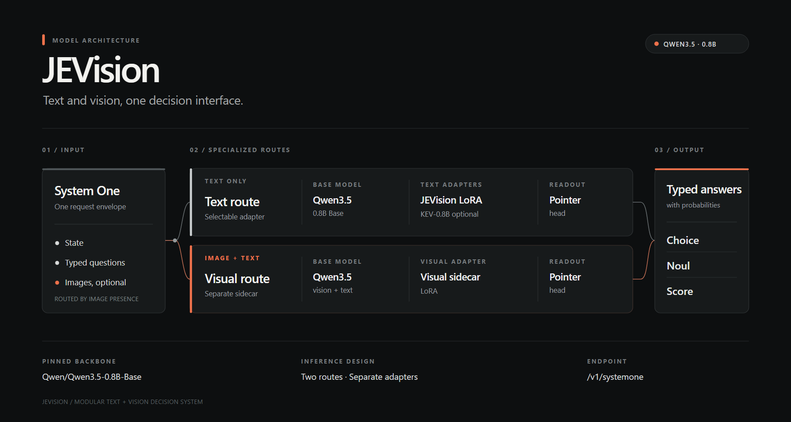

# Divyansh Sikarwar

**Software Development Engineer · Backend systems · Applied AI**

I build backend services and AI-enabled workflows. At Zomato, my work focuses on consumer-facing agents and evaluating real-time conversations that can include long tool outputs and images. JEVision is a personal side project exploring structured evaluation across text and visual inputs.

[LinkedIn](https://www.linkedin.com/in/divyanshsikarwar/) · [Email](mailto:Divyanshsikarwar@gmail.com) · [GitHub](https://github.com/divyanshsikarwar)

## Work Experience

**Software Development Engineer** 
[**Zomato**](https://www.zomato.com/) • 2026–Present 
Focus: consumer-facing agent workflows, evaluation of tool-rich conversations, and visual inputs.

 

---

**Software Development Engineer** 
[**Attentive.ai**](https://attentive.ai/) • Feb 2024–2026 
Languages & Technologies: `Python`, `Django`, `SQL`, `Redis`, `RabbitMQ`, `OAuth 2.0`, `GCP`, `Docker`
- Develop and maintain backend systems with Python and Django in a microservices architecture.
- Manage SQL, Redis, and RabbitMQ services for high availability across backend systems.

 

---

**Software Development Engineer** 
[**Testbook**](https://testbook.com/) • Feb 2023–Jan 2024 
Languages & Technologies: `Go`, `Gorilla Mux`, `MongoDB`, `Redis`, `JavaScript`, `JWT`, `GCP`
- Developed backend applications with Go, MongoDB, and Redis.
- Worked on database operations and availability for Testbook backend services.

 

---

**Software Engineer Intern** 
[**Nagarro**](https://www.nagarro.com/en) • Jun–Aug 2022 
Languages & Technologies: `Node.js`, `Express.js`, `MongoDB`, `JavaScript`, `React`, `CSS`
- Built and maintained web applications using full-stack technologies.
- Worked on Node.js services, APIs, and database integrations.

 

## Projects

[**JEVision**](https://huggingface.co/divyanshx11/JEVision) • Side project · [GitHub repository](https://github.com/divyanshsikarwar/JEVision) 
Qwen3.5-based structured evaluation for text and image inputs. Text requests use a trained LoRA adapter and pointer head; image-bearing requests route to a separate visual LoRA sidecar and pointer head. Responses use typed **Choice**, **Noul**, and **Score** outputs through a JEV-style interface.

---

[**YumTrip**](https://yumtrip.netlify.app/) • Personal 
Languages & Technologies: `React.js`, `Express.js`, `Node.js`, `MongoDB`, `AWS`, `Socket.io`
- Developed a QR-based, dine-in order management web app.
- Built order search and scanning, management, and customer/restaurant-owner views.

 

---

[**Kalam**](http://kalam-editor.netlify.app/) • Personal 
Languages & Technologies: `React.js`, `Socket.io`, `Express.js`, `MongoDB`, `Node.js`
- Developed a collaborative text editor with real-time updates and password protection.
- Added view-only and admin modes for shared documents.

 

---

[**ISS Locator**](http://allaboutiss.000webhostapp.com/) • Personal 
Languages & Technologies: `JavaScript`, `HTML`, `CSS`, `Bootstrap`, `NASA APIs`
- Built a web app showing International Space Station details and live location on a map.
- Integrated APIs for location, geocoding, and reverse geocoding.

 

## Skills

- **Languages:** Go, Python, JavaScript; familiar with C++ and HTML
- **Frameworks:** Django, Mux, React, OAuth 2.0
- **Tools & Platforms:** GCP, AWS, Docker, Grafana, RabbitMQ, Elasticsearch
- **Databases:** MongoDB, Redis, SQL
- **Applied AI:** LoRA fine-tuning, multimodal inference, structured outputs, agent evaluation

**Education:** Jaypee Institute of Information Technology · 2019–2023

Zomato logo: <a href="https://commons.wikimedia.org/wiki/File:Zomato_logo.png">Wikimedia Commons</a>.

Find me on [LinkedIn](https://www.linkedin.com/in/divyanshsikarwar/) for my full work history, education, and certifications.
